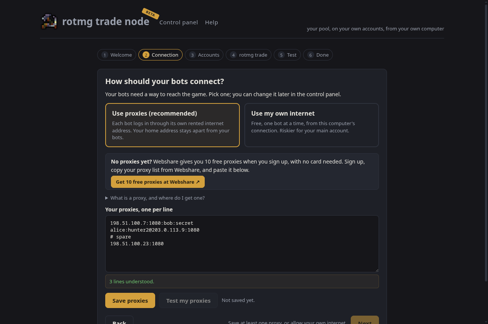
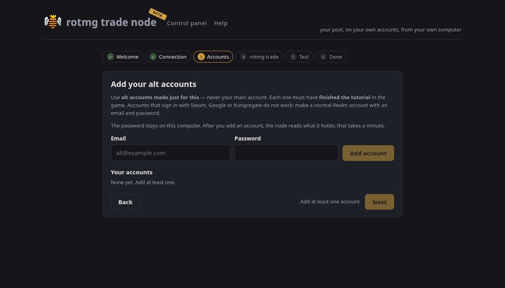
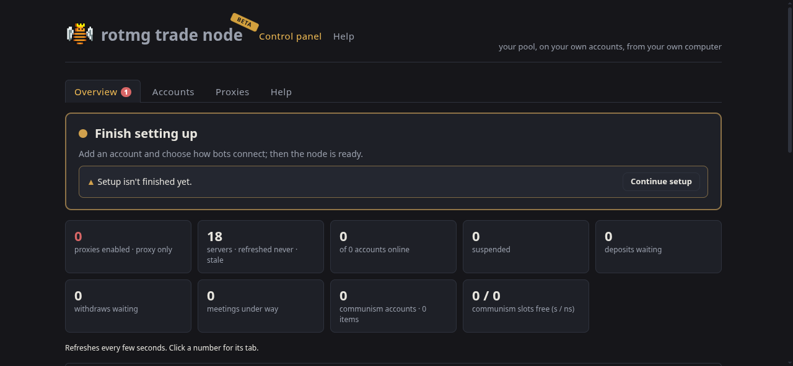
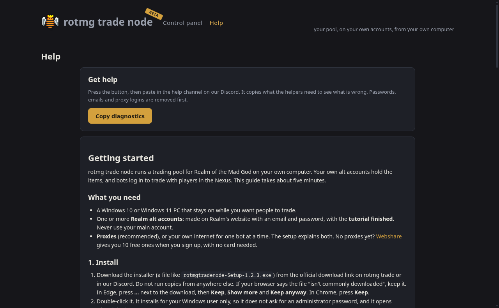

# Getting started

rotmg trade node runs a trading pool for Realm of the Mad God on your own computer. Your own alt accounts hold the items, and bots log in to trade with players in the Nexus. This guide takes about five minutes.

## What you need

- A Windows 10 or Windows 11 PC that stays on while you want people to trade.
- One or more **Realm alt accounts**: made on Realm's website with an email and password, with the **tutorial finished**. Never use your main account.
- **Proxies** (recommended), or your own internet for one bot at a time. The setup explains both. No proxies yet? [Webshare](https://www.webshare.io/) gives you 10 free ones when you sign up, with no card needed.

## 1. Install

1. Download the installer (a file like `rotmgtradenode-Setup-1.2.3.exe`) from the official download link on [rotmg.trade](https://rotmg.trade) or in our Discord. Do not run copies from anywhere else.
   If your browser says the file "isn't commonly downloaded", keep it. In Edge, press **…** next to the download, then **Keep**, **Show more** and **Keep anyway**. In Chrome, press **Keep**.
2. Double-click it. It installs for your Windows user only, so it does not ask for an administrator password, and it opens when it is done.

**If Windows says "Windows protected your PC":** the app is not signed yet, so Windows does not know who made it and calls it "Unknown publisher". If you downloaded the installer from the official link, click **More info**, then **Run anyway**. If you are not sure where the file came from, do not run it. You only see this when you install: updates install without it.

**If Windows says "Smart App Control blocked an app":** that Windows 11 setting blocks every app that is not signed, and it has no **Run anyway**. See the [FAQ](faq.md).

**If your antivirus warns you:** some antivirus programs are wary of new apps that are not signed yet. Only allow it if you got it from the official link.

## 2. The setup

The setup opens by itself the first time you start the app. You can go back and forth between the steps; nothing is lost if you close it halfway.

1. **Welcome.** What the app does and what you need.
2. **Connection.** Choose how your bots reach the game:
   - **Use proxies (recommended).** Paste the list your proxy seller gave you, press **Save proxies**, then **Test my proxies**. Each line shows whether it works. If you have none yet, press **Get 10 free proxies at Webshare**, sign up, and copy the list Webshare gives you.
   - **Use my own internet.** Free, but your bots and your main account then come from the same home address. Read the warning, tick **I understand**, and only one bot logs in at a time.
3. **Accounts.** Add your alt accounts one by one with their email and password. "Added" means Realm accepted the account. If something is wrong, the setup says what to do.
4. **rotmg trade (optional).** Linking lets people find your pool on the [rotmg trade website](https://rotmg.trade). Sign in on [rotmg.trade](https://rotmg.trade), open **My nodes**, press **Link my node**, and paste the code. You can skip this and do it later.
5. **Test.** Press **Log in a bot now**. After up to a minute you should see "<name> is standing in the Nexus". If not, the message says what to fix.
6. **Done.** The control panel opens.

## 3. Everyday use

- **The tray.** Closing the window does not stop the node: it keeps running in the tray, the small icons near the clock (click the ^ arrow if you do not see it). Click the icon to open the window again.
- **Quitting.** Right-click the tray icon and choose **Quit**. This logs every bot out.
- **The status card.** The control panel starts with a card that says what the node is doing, and puts a button next to anything that needs you.
- **Keep the PC awake.** If Windows goes to sleep, your bots go offline. Control panel → Help → App settings → **Keep this PC awake while the node runs** (on by default). The screen can still turn off.
- **Start with Windows.** Turn this on in the same place to have the node start quietly in the tray when you sign in.

## 4. Updates

- **The app updates itself.** When a new version is ready, it tells you, and installs it the next time you quit.
- **When Realm updates the game,** logins pause until the rotmg trade team confirms the new game version works with the node (or an app update arrives with it). You do not need to do anything; the status card says when this is happening, and the bots log in again by themselves.

## 5. Getting help

Open the control panel, go to **Help**, and press **Copy diagnostics**. Paste it in the help channel on our Discord. Passwords, emails and proxy logins are removed before it is copied.

